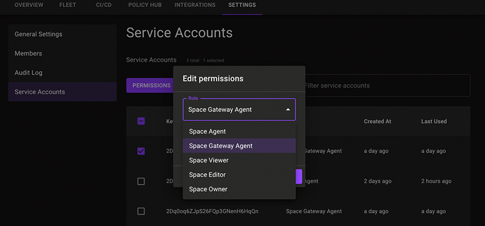

# Mondoo Policy Action

A GitHub Action for publishing Mondoo policies to Mondoo Platform.

## Service Account Permissions



Adding policies to Mondoo Platform requires a [Mondoo service account](https://mondoo.com/docs/platform/service_accounts/#creating-service-accounts) with elevated permissions. Use the **Space Gateway Agent** permissions to add policies to Mondoo Platform.

## Properties

The Mondoo Policy Action has properties which are passed to the underlying image. These are passed to the action using `with`.

| Property                      | Required | Default | Description                                                                                                                                                                                                                      |
| ----------------------------- | -------- | ------- | -------------------------------------------------------------------------------------------------------------------------------------------------------------------------------------------------------------------------------- |
| `log-level`                   | false    | info    | Sets the log level: error, warn, info, debug, trace (default "info")                                                                                                                                                             |
| `path`                        | true     |         | Path to the policy file.                                                                                                                                                                                                         |
| `service-account-credentials` | false    |         | Base64 encoded [service account credentials](https://mondoo.com/docs/platform/service_accounts/#creating-service-accounts) used to authenticate with Mondoo Platform. You can also use the environment variable mentioned below. |

Additionally, you need to specify the service account credentials as an environment variable.

| Environment            | Required | Default | Description                                                                                                                                                          |
| ---------------------- | -------- | ------- | -------------------------------------------------------------------------------------------------------------------------------------------------------------------- |
| `MONDOO_CONFIG_BASE64` | true     |         | Base64 encoded [service account credentials](https://mondoo.com/docs/platform/service_accounts/#creating-service-accounts) used to authenticate with Mondoo Platform |

## Add a policy to Mondoo Platform

You can use the Action as follows:

```yaml
name: Mondoo Policy Add Example
on:
  push:
    paths:
      - "policy/policy.yml"
jobs:
  upload:
    runs-on: ubuntu-latest
    steps:
      - uses: actions/checkout@v3
      - uses: mondoohq/actions/policy@v0.9.0
        env:
          MONDOO_CONFIG_BASE64: ${{ secrets.MONDOO_SERVICE_ACCOUNT }}
        with:
          path: policy/policy.yml
```
