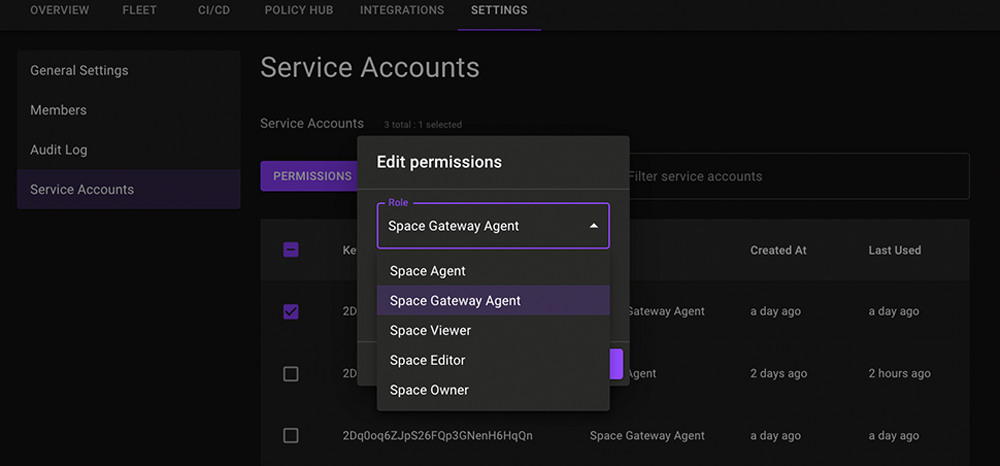

# Mondoo Policy Action

A [GitHub Action](https://github.com/features/actions) for publishing Mondoo policies to Mondoo Platform.

## Requirements

- This is a Docker container action and runs only on Linux runners (e.g. `ubuntu-latest`).
- A [Mondoo service account](https://mondoo.com/docs/maintain/access/non-human/service_accounts) with **elevated (Space Gateway Agent)** permissions is required to add policies to Mondoo Platform (see below).

## Service Account Permissions



Adding policies to Mondoo Platform requires a [Mondoo service account](https://mondoo.com/docs/maintain/access/non-human/service_accounts) with elevated permissions. Use the **Space Gateway Agent** permissions to add policies to Mondoo Platform.

## Properties

The Policy Action has properties that are passed to the action using `with`.

| Property                      | Required | Default | Description                                                                                                                                                                                                            |
| ----------------------------- | -------- | ------- | ---------------------------------------------------------------------------------------------------------------------------------------------------------------------------------------------------------------------- |
| `log-level`                   | false    | info    | Sets the log level: error, warn, info, debug, trace (default "info")                                                                                                                                                   |
| `path`                        | true     |         | Path to the policy file.                                                                                                                                                                                               |
| `service-account-credentials` | false    |         | Base64 encoded [service account credentials](https://mondoo.com/docs/maintain/access/non-human/service_accounts) used to authenticate with Mondoo Platform. You can also use the environment variable mentioned below. |

Additionally, you need to specify the service account credentials as an environment variable.

| Environment            | Required | Default | Description                                                                                                                                                |
| ---------------------- | -------- | ------- | ---------------------------------------------------------------------------------------------------------------------------------------------------------- |
| `MONDOO_CONFIG_BASE64` | true     |         | Base64 encoded [service account credentials](https://mondoo.com/docs/maintain/access/non-human/service_accounts) used to authenticate with Mondoo Platform |

## Add a policy to Mondoo Platform

```yaml
name: Mondoo Policy Add Example
on:
  push:
    paths:
      - "policy/policy.yml"
jobs:
  upload:
    runs-on: ubuntu-latest
    steps:
      - uses: actions/checkout@v5
      - uses: mondoohq/actions/policy@v13.0.0
        env:
          MONDOO_CONFIG_BASE64: ${{ secrets.MONDOO_SERVICE_ACCOUNT }}
        with:
          path: policy/policy.yml
```

## Join the community!

Join the [Mondoo Community GitHub Discussions](https://github.com/orgs/mondoohq/discussions) to collaborate on policy as code and security automation.

## License

[Mozilla Public License v2.0](https://github.com/mondoohq/actions/blob/main/LICENSE)
